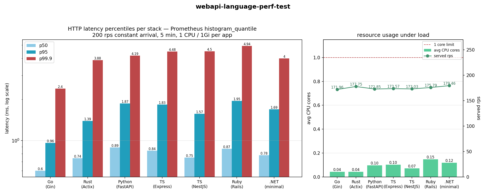
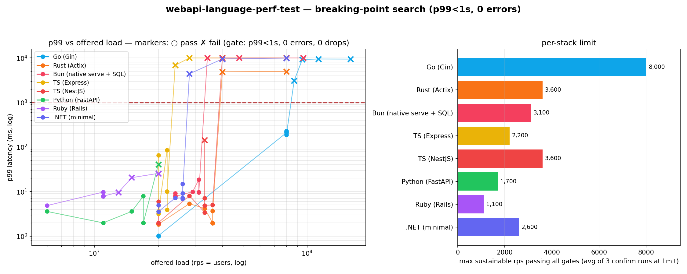

# webapi-language-perf-test

One tiny Twitter-style API, implemented in **8 language stacks**, benchmarked head-to-head
inside a Kubernetes cluster with identical resources, identical SQL, identical load —
latency percentiles taken from **Prometheus** (scraped off each app's own histograms) and
visualized in **Grafana**. Phase 2 finds each stack's **breaking point** with an adaptive
load ladder.



## The app

`GET /feed?page=N` · `GET /posts/:id` · `POST /posts` · `POST /posts/:id/like`
backed by Postgres seeded with **50,000 users / 500,000 posts / ~2.2M likes**.

| app dir | stack | image |
|---|---|---|
| `apps/go` | Go 1.25 · Gin v1 · pgx v5 | `localhost:32000/langperf/go:v1` |
| `apps/rust` | Rust · Actix-web 4 · tokio-postgres + deadpool | `…/rust:v1` |
| `apps/bun` | **Bun 1.4 · native `Bun.serve` + built-in Postgres SQL (zero deps)** | `…/bun:v1` |
| `apps/python` | Python 3.12 · FastAPI · uvicorn[standard] · asyncpg | `…/python:v1` |
| `apps/express` | Node 22 · Express 5 · pg | `…/express:v1` |
| `apps/nestjs` | Node 22 · NestJS 11 (FastifyAdapter) · pg | `…/nestjs:v1` |
| `apps/rails` | Ruby 3.3 (YJIT) · Rails 8 API · Puma · pg | `…/rails:v1` |
| `apps/dotnet` | .NET 10 · ASP.NET Core minimal APIs · Npgsql | `…/dotnet:v1` |

## Fairness contract

- **Identical SQL** — [`sql/queries.sql`](sql/queries.sql) is the single source of truth; every
  stack issues byte-identical statements (verified by grep audit + agent-diffed reports).
- **Identical resources** — every app: `limits: cpu 1 / memory 1Gi` in a dedicated pod,
  DB pool max 8, no access logging, JSON-only responses.
- **Identical metrics** — every app exposes `http_request_duration_seconds` (histogram,
  labels `method/route/status`, same 14 buckets) + `http_requests_total` +
  `app_memory_rss_bytes` (self-reported RSS from /proc), scraped by the same PodMonitor
  (`job="langperf/langperf-apps"`, 15s interval).
- **Identical load** — k6 `constant-arrival-rate` (open model) at 200 rps for 5 min per app,
  mix 55% feed / 20% single post / 15% create post / 10% like, one app at a time,
  k6 in its own pod (4-core limit, effectively unlimited RAM).
- **Pass/fail gates** (per stack, from Prometheus): `p95 < 500ms`, `p99 < 1s`, `errors < 1%`.

## Results

Full tables: [`results/summary.md`](results/summary.md) · raw data: `results/*.json`.

### Baseline — 200 rps × 5 min (server-side, Prometheus `histogram_quantile`)

| stack | p50 ms | p95 ms | p99 ms | p99.9 ms | served rps | avg CPU | max pod RAM | verdict |
|---|---|---|---|---|---|---|---|---|
| Go (Gin) | 0.60 | 0.96 | 1.00 | 2.40 | 172 | 0.044 | 15 MB | **PASS** |
| Rust (Actix) | 0.74 | 1.39 | 1.90 | 3.88 | 178 | 0.044 | 8 MB | **PASS** |
| .NET (minimal) | 0.78 | 1.69 | 1.95 | 4.00 | 179 | 0.119 | 73 MB | **PASS** |
| NestJS (Fastify) | 0.75 | 1.57 | 1.96 | 4.50 | 173 | 0.072 | 51 MB | **PASS** |
| Express | 0.84 | 1.83 | 1.98 | 4.48 | 174 | 0.103 | 39 MB | **PASS** |
| Python (FastAPI) | 0.89 | 1.87 | 1.98 | 4.19 | 173 | 0.098 | 42 MB | **PASS** |
| Rails 8 (YJIT) | 0.87 | 1.95 | 4.15 | 4.94 | 176 | 0.147 | 109 MB | **PASS** |

All seven pass all three gates with 0% 5xx. The spread is small (2–4× between extremes)
because with a well-indexed DB the web framework is no longer the bottleneck — every
request is ~90% Postgres round-trip time (~0.2–0.5ms) plus serialization.

### Stress ramp — 200→1800 rps over 4 min

No stack breached any gate within the ramp; the ceiling of this rig (single Postgres,
single node, 1800 rps offered) is the limit, not app CPU. Max rps passing all gates:
Go 1743 · Express 1726 · Python 1701 · NestJS 1699 · Rust 1673 · .NET 1651 · Rails 1616.
Rails shows the most gradual degradation (p95 1.9→4.9ms across the ramp) — consistent
with its highest CPU per request (0.15 cores at just 200 rps).

### RAM (max working set, 1Gi limit)

Rust 8MB · Go 15MB · Express 39MB · Python 42MB · NestJS 51MB · .NET 73MB · Rails 109MB

## Phase 2 — breaking-point search



Method: per stack, an adaptive ladder starts at 2k rps, **jumps ×4 when a level looks easy**
(p99 < 150ms, cpu < 0.85), ×2 otherwise, and on first failure **geometric-bisects** between
last pass and first fail. The found limit is then **confirmed with 3 fresh-DB runs**.
Gate: `p99 < 1s`, zero 5xx, zero k6 failed requests, zero dropped iterations, and
**served ≥ 95% of offered** (the throughput clause catches silent load-shedding — without
it, a saturated app can "pass" while dropping half its offered requests).

Stable limits (highest load where *every* run passed; full curves in
[`results/limits-summary.md`](results/limits-summary.md)):

| stack | stable limit (rps) | confirm p99 @ limit | bottleneck |
|---|---|---|---|
| Go (Gin) | **8,000** | 212 ms | queueing collapse past ~8.7k |
| Rust (Actix) | 3,600 | 2.5 ms | cliff: 2ms → 4.9s between 3.6k and 4k |
| TS (NestJS Fastify) | 2,800 (borderline to 3,300) | ~6 ms @ 3.3k clean runs | cliff, soft edge |
| Bun (native) | 3,100 | 9.7 ms | cliff: 18ms → 10s between 3.1k and 3.4k |
| .NET (minimal) | 2,600 | 10.3 ms | cliff |
| TS (Express) | 2,200 | 8.0 ms | cliff |
| Python (FastAPI) | 1,700 | 2.0 ms | cliff |
| Ruby (Rails 8 YJIT) | 1,100 | 7.9 ms | app CPU (the only true CPU-bound failure) |

Observations:

- **Go is in a class of its own** — it serves the full 8,000 rps at p99 ~210ms using 0.7
  cores, then collapses within ~9% more load. Its failure mode is graceful (rising tail),
  everyone else's is a wall (sub-50ms → multi-second).
- **Bun confirms the "faster than Node" hypothesis** in efficiency: at 2,400 rps it used
  0.32 cores vs Express's 0.63 and NestJS's 0.47, and its limit (3,100) beats Express (2,200)
  — but native Bun does not reach NestJS-Fastify territory (3,300 borderline / 2,800 strict)
  or Rust/Go.
- Most stacks fail not by CPU saturation but by a **queueing collapse** — served throughput
  plateaus at capacity while the tail explodes. Rails is the only stack that genuinely
  ran out of CPU first.
- k6 itself never starved: at 64k offered it used ≤1.4 of its 6 cores; Postgres (6-core
  limit) stayed below 4.1 cores at every stack's limit — failures below ~9k rps are
  attributable to the app stack, not the rig.

## The lesson that shaped the benchmark

The first run **melted** (p99 > 9s, 1000 k6 VUs stuck): the "obvious" feed query —

```sql
SELECT … , COUNT(l.id) FROM posts p JOIN users u … LEFT JOIN likes l …
GROUP BY p.id … ORDER BY p.created_at DESC LIMIT 20 OFFSET …
```

forces Postgres to aggregate **all 500k posts + 2.2M likes** before the LIMIT can apply —
a 2.2M-row hash join spilling 69MB to disk, per request. The fix ([`sql/queries.sql`](sql/queries.sql) Q1)
is a CTE that picks the 20 posts via the `posts(created_at DESC, id DESC)` index **first**,
then joins/counts only those rows: **multi-seconds → ~1–5ms** (verified with EXPLAIN
ANALYZE). No index can rescue the flat form — the SQL shape is the fix.

## Cluster setup

- MicroK8s single node (10 cores / 41GB), namespace `langperf`
- Postgres 16 (dedicated StatefulSet): 1 CPU request / 3 CPU limit, 3Gi; `shared_buffers=768MB`,
  `synchronous_commit=off`; indexes: `posts(created_at DESC,id DESC)`, `posts(user_id)`,
  `likes(post_id)`, `likes(user_id)`, `UNIQUE(post_id,user_id)`
- kube-prometheus-stack (pre-existing): PodMonitor scrapes app pods at 15s
- k6 2.3.0 Job: cpu limit 4, no memory limit, open-model arrival rate

## Repo layout

```
apps/<stack>/     source + Dockerfile + k8s.yaml per stack
k8s/              postgres, seed job, k6 job, podmonitor, app template
k6/loadtest.js    load profile (MODE=baseline|ramp)
sql/queries.sql   canonical SQL (the fairness contract)
scripts/          deploy-infra.sh, run-test.sh, collect_results.py, make_chart.py, make_report.py, import-dashboard.sh
results/          raw JSON per app + comparison.png + summary.md
dashboards/       Grafana dashboard JSON (import via scripts/import-dashboard.sh)
```

## Reproduce

```bash
bash scripts/deploy-infra.sh                      # postgres + seed + podmonitor
# build+push each app (see SPEC.md), then:
for a in go rust express nestjs python rails dotnet; do bash scripts/run-test.sh $a; done
python3 scripts/make_report.py && .venv/bin/python scripts/make_chart.py
bash scripts/import-dashboard.sh                  # Grafana dashboard
```

Grafana dashboard: **LangPerf — Web API Language Benchmark** (p50/p95/p99/p99.9, rps, CPU,
self-reported RSS, cgroup memory per app).
